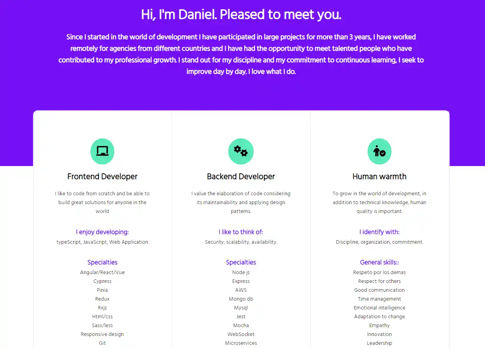
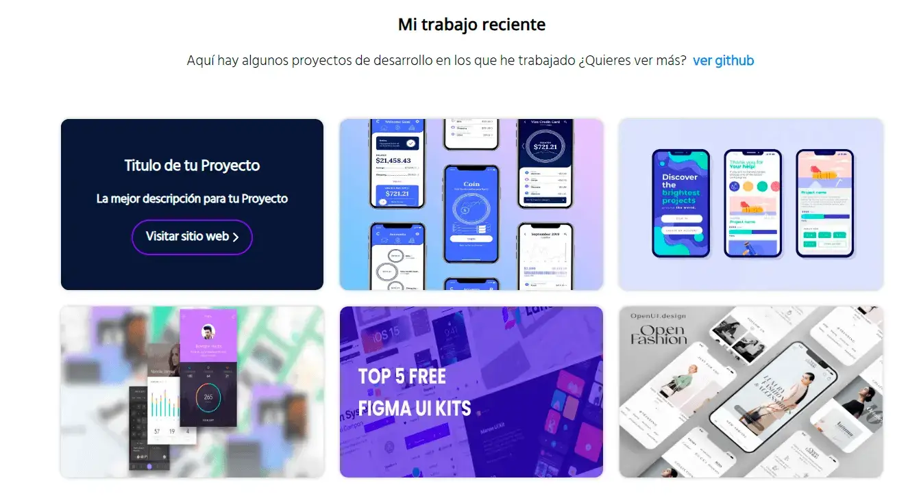
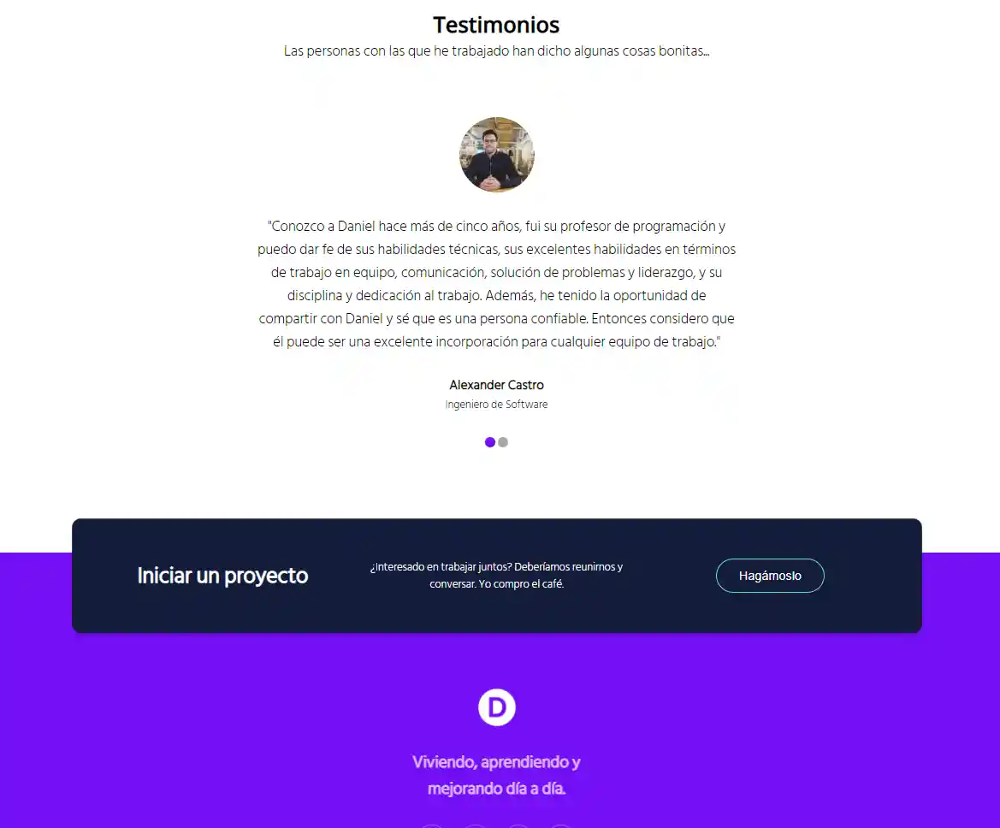
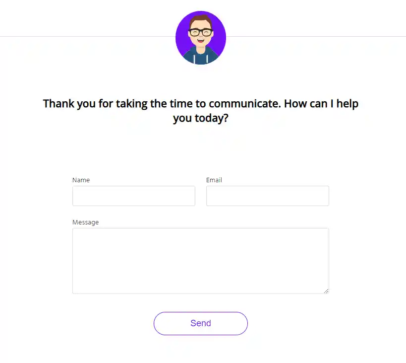
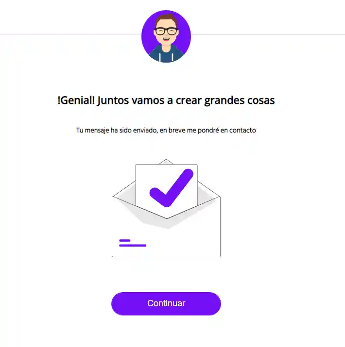

# Pagina Personal


Página persona, desarrollado con ``Angular 14``. Este sistema te proporciona una plantilla de página personal fácil de personalizar y que además cuenta con un diseño adaptativo a diferentes dispositivos.

[Demo](https://danidev-portafolio.netlify.app/)
## Contacto 🚀

- Website: https://danidev.me/
- LinkedIn: [@dani-dev](https://www.linkedin.com/in/dani-dev/)
- Github: [@ldanidev](https://github.com/ldani-dev)
- Twitter: [@ldanidev](https://twitter.com/ldanidev)
## Contenido
### **- Vista Principal**
Esta es la vista principal de la página, donde puedes modificar tu icono y Nombre de la página. Además, se puede seleccionar el idioma de su preferencia (Actualmente `Inglés` o ``Español``)
<br>
<br>

<br>

### **- Acerca de**
En esta sección puedes agregar toda tu información relevante.
Además, cuenta con un segmento en donde puedes detallar todas tus habilidades ``técnicas`` y ``humanas``.
<br>
<br>
  
<br>

### **- Proyectos**
En este apartado puedes agregar todos tus proyectos y darle a conocer al mundo tu ``maravilloso trabajo``.
<br>
<br>

<br>


### **- Recomendaciones**
Puedes agregar todos los testimonios de las personas con las cuales has trabajado.
<br>
<br>
 
<br>
<br> 

## **Contacto**
Esta seccion le permite a cualquier persona contactarte de una manera facil y rapida. 
<br> 



### **- Contacto Exitoso**

<br>

### **- Pagina No encontrada** 

<br>

## Instalación

Es necesario clonar el repositorio de ``github``, para ello,  ejecuta el siguiente comando.

```
git clone https://github.com/ldani-dev/public-personalPage.git
```

Para instalar todas las dependencias necesarias ejecuta.

```
npm install
```

y por último

```
ng serve
```

Tu aplicación se ejecutara automaticamente en la ruta `http://localhost:4200/`.

# Principales Funcionalidades

## - Multi-Idioma

El sistema utiliza la libreria [ngx-translate](https://github.com/ngx-translate/core). la cual permite manejar multiples idiomas. Para este proyecto se maneja el idioma ingles y español.

### Ubicacion Archivos de Idiomas

```
src/assets/i18n/
```

En esta ruta se encuentran dos archivos `en.json` y `es.json` Cada uno contiene todas los textos del sistema en sus respectivos idiomas.

## - Diseño responsive

El sistema es adaptativo a varios dispositivos utilizando la libreria [ngx-device-detector](https://www.npmjs.com/package/ngx-device-detector).  y `estilos css`.

## - Envio de Correo

El sistema utiliza [emailJs](https://www.emailjs.com/) para recibir todos los correos enviados desde el formulario de contacto.
<br>


<br>

Crea una cuenta y coloca tus credencias en el archivo. `src/environments/environment.prod.ts` es completamente gratis!!
